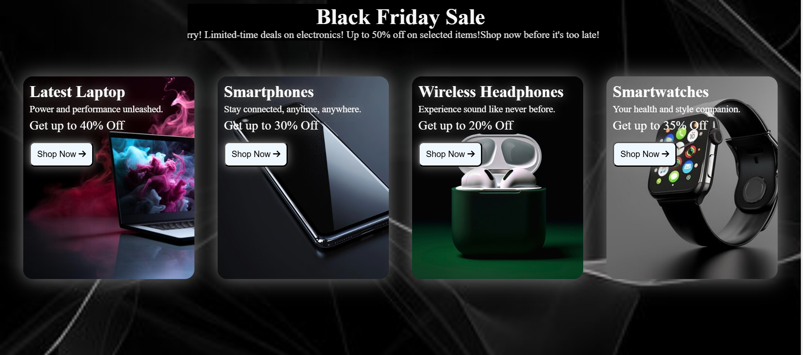

# 🛒 Black Friday Electronics Deals  

A **responsive** webpage showcasing the best **Black Friday electronics deals**, built using **HTML, CSS, and Media Queries**. This project helped me practice styling, layout design, and making a webpage mobile-friendly.  

## 🚀 Features  
- **Attractive Black Friday Sale banner**  
- **Product cards** with discounts and details  
- **Hover effects & box shadows** for a modern look  
- **Responsive design** using media queries for different screen sizes  

## 📸 Screenshots  

## 🛠️ Technologies Used  
- HTML  
- CSS  
- Media Queries  
- FontAwesome (for icons)  

## 📂 How to Use  
1. Clone the repository:  
   git clone https://github.com/ManvithaPola/Media-queries.git
2. Open index.html in your browser.

## 🌍 Live Demo
https://mediaqueries-manvitha.netlify.app/

## 🎯 What I Learned
Implementing media queries for responsiveness
Using background images effectively
Creating stylish product cards with hover effects
